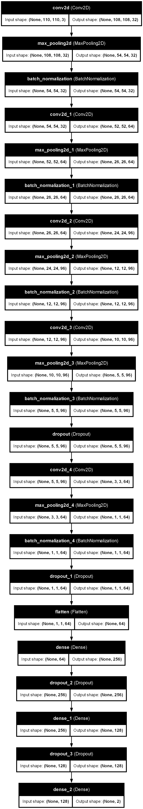

# Wide ResNet50-2 모델 설명

~ 기본 개념

ResNet (Residual Network)은 딥러닝에서 매우 깊은 네트워크를 효과적으로 훈련할 수 있도록 설계된 구조입니다.

~ 특징

이 모델은 잔차 연결(residual connections)을 통해 입력을 레이어의 출력에 직접 더해주어, 깊은 네트워크에서 발생할 수 있는 소실된 기울기(vanishing gradient) 문제를 해결합니다.
"Wide"는 네트워크의 채널 수가 표준 ResNet50에 비해 더 많다는 것을 의미합니다. Wide ResNet50-2는 채널의 수를 두 배로 증가시켜, 더 많은 특징을 추출할 수 있도록 설계되었습니다.

```
import torch
from torchviz import make_dot
from torchvision.models import wide_resnet50_2, Wide_ResNet50_2_Weights

def main():
    # 모델 로드, 사전 훈련된 가중치 사용
    model = wide_resnet50_2(weights=Wide_ResNet50_2_Weights.IMAGENET1K_V1)
    # 더미 입력 데이터
    x = torch.randn(1, 3, 224, 224)
    # 모델 실행
    y = model(x)
    # 계산 그래프 시각화
    dot = make_dot(y, params=dict(list(model.named_parameters())))
    # 이미지 파일로 계산 그래프 저장
    dot.render("wide_resnet50_2_architecture", format="png")

if __name__ == '__main__':
    main()
```


# 사용자 정의 CNN 모델

~ 모델 구조

간단한 CNN 모델로, 세 개의 컨볼루션 레이어와 두 개의 완전 연결된 레이어로 구성됩니다.
중간에는 최대 풀링과 드롭아웃 레이어가 포함되어 있어, 과적합을 방지하고 특징을 요약합니다.

~ 기술적 설명

레이어 구성:
첫 번째 컨볼루션 레이어는 32개의 필터를 사용하여 입력 이미지에서 저수준 특징을 추출합니다.
두 번째와 세 번째 레이어는 각각 64와 128개의 필터를 사용, 더 복잡한 특징을 추출합니다.
각 컨볼루션 레이어 후에는 최대 풀링을 사용하여 차원을 축소하고, 드롭아웃은 과적합을 방지합니다.


```
import torch
import torch.nn as nn
import torch.nn.functional as F
from torchviz import make_dot

class CNNModel(nn.Module):
    def __init__(self):
        super(CNNModel, self).__init__()
        self.conv1 = nn.Conv2d(1, 32, 5, 1)
        self.conv2 = nn.Conv2d(32, 64, 5, 1)
        self.conv3 = nn.Conv2d(64, 128, 5, 1)
        self.fc1 = nn.Linear(9*9*128, 2046)  # 수정된 완전 연결 계층 입력 크기
        self.fc2 = nn.Linear(2046, 4)

    def forward(self, x):
        x = F.relu(self.conv1(x))
        x = F.max_pool2d(x, 2, 2)
        x = F.relu(self.conv2(x))
        x = F.max_pool2d(x, 2, 2)
        x = F.relu(self.conv3(x))
        x = x.view(-1, 9*9*128)  # 수정된 크기
        x = F.dropout(F.relu(self.fc1(x)), p=0.5, training=self.training)
        x = self.fc2(x)
        return x

# 모델 인스턴스 생성
model = CNNModel()

# 더미 입력 생성 (예: 1개의 1x28x28 이미지)
inputs = torch.randn(1, 1, 64, 64)

# 모델의 forward 경로를 시각화
y = model(inputs)
dot = make_dot(y, params=dict(list(model.named_parameters()) + [('input', inputs)]))
dot.render('cnn_model', format='png', cleanup=True)  # 'cnn_model.png' 파일 생성
```


# image classification에 쓰이는 plot_model

~ 모델 아키텍처 설명

사용된 CNN 모델은 주로 이미지 처리 작업에 사용되며, 여러 개의 컨볼루션 레이어와 풀링 레이어, 완전 연결 레이어로 구성되어 있습니다. 
각 레이어는 특정 기능을 수행하며, 예를 들어 컨볼루션 레이어는 이미지에서 유용한 특징을 추출하는 데 사용됩니다.

~ TensorFlow의 plot_model 기능 사용

show_shapes=True는 각 레이어의 입력 및 출력 형태를 표시하게 하며, show_layer_names=True는 각 레이어의 이름을 표시합니다.


```
import tensorflow as tf
from tensorflow.keras.utils import plot_model  # 올바른 임포트 방법

# 모델 불러오기
from model import get_model

# TensorFlow 스타일의 더미 입력 데이터 생성
x = tf.random.normal([1, 110, 110, 3])

# 모델 인스턴스 생성
model = get_model()

# 모델 실행
out = model(x)

# 모델 아키텍처 시각화
plot_model(model, to_file='model_architecture.png', show_shapes=True, show_layer_names=True)
'''




