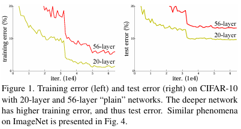
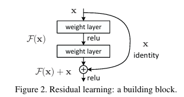
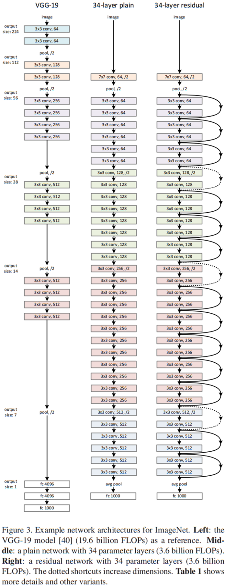
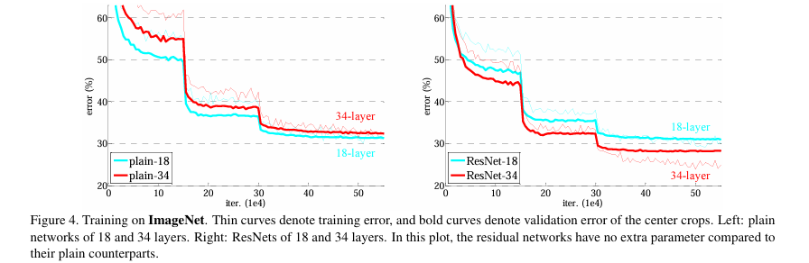
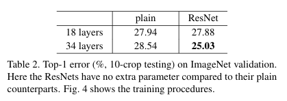

# Resnet
### 5조 개인과제 이현우
논문명 :  Deep Residual Learning for Image Recognition  

기존 CNN 의 이미지 인식은 network 의 layer (층) 을 겹쳐가면서 진행.
그러나 어느정도의 layer 가 깊게 쌓이면, 오히려 학습효과가 증가하는게 아닌 감소하는 경향을 보임. 

  
 - 해당 논문에서 CIFAR-10 데이터셋에 대해 20-layer,56-layer을 비교시 
 오히려 56-layer 의 error 가 더 큰 모습

이는 gradient vanishing(너무 커지거나) / exploding (사라지는) 현상임.
위 논문에서는 이 문제에 대한 해결방안을 Residual Learning 으로 제시함. 

  
 - Residual block

- 기존의 CNN 은 입력값 x 에서 F(x) = H(x), 즉 타깃값 y 로 매핑하는 함수 H(x) 를 얻는것이 목적이었음. 
- resnet 에서는 F(x)+x 를 최소화 시키는것이 목적. x (즉 input) 은 변할수 없는 값이므로 F(x) 를 0에 가깝게 만들어야하는데 , F(x) = H(x)+x 이므로, F(x)를 최소로 해준다는 것은, F(x) = H(x) - x 즉, H(x) - x를 최소로 하는 것. 여기서 H(x)-x 를 잔차 (residual) 이라고 한다. 
  
위 과정에서 skip connection(=identify mapping, 입력값 = 출력값) 을 사용하여 곱셈 연산에서 덧셈 연산으로 변환되며, 그로인해 정보의 전달이 쉬워지며, 연속된 곱셈(layer 중첩) 으로 인한 vanishing 이 일어나지 않음  

  
 - VGG, plain, residual network 비교

해당 논문에서는 비교를 위해 3가지의 모델을 비교하는데  

- VGG 네트워크: VGG 네트워크는 3x3 컨볼루션 레이어를 중첩하여 사용하며, 특징 맵 크기가 반으로 줄어들 때 필터의 수를 두 배로 늘리는 것이 특징
- Plain 네트워크: Plain 네트워크는 VGG의 설계 철학을 따르고,  feature map size가 절반으로 줄어들면 채널 수를 두 배로 늘림. feature map을 줄일 때는 Conv filter의 stride를 2로 설정.Plain Network는 VGGNet보다 필터수가 적고 간단한 구조임 (34개의 layer는 36억 Flops로 VGGNet의 18%)
  
- Residual 네트워크: Residual 네트워크는 Plain 네트워크에 skip connection을 추가. 만약 입력과 layer를 통과한 출력의 차원이 다르다면 두 가지 방법으로 차원을 조절함
  -  첫 번째는 단순히 zero padding하는것으로 추가적인 파라미터가 없습니다. 
  -  두 번째는 projection shortcut하는 방법으로 차원을 맞추기 위해 1x1 Conv Filter를 통과시킵니다.
  
실험은 ImageNet 데이터셋을 사용하여 진행, 18-layer, 34-layer 에서 비교를 진행함.

  
 - plain(좌) , ResNet(우) 
 
 - Top-1 error(실제 정답 1개를 맞춰야하는 문제)

결과
- plain network 에서는 더 얇은 망인 18-layer 에서 보다 더 깊은 망인 34-layer 에서 error 가 더 큰 validation error 가 발생함.
- ResNet 에서는 validation error 없이 더 깊은 망에서 더 좋은 정확도를 보임.