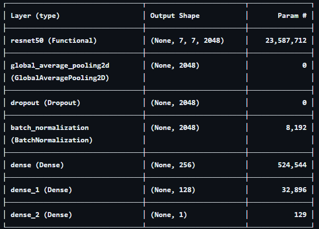

Test accuracy : 0.8697478771209717
Test loss : 0.6299006342887878
Model: "sequential"

 Total params: 39,691,140 (151.41 MB)
 Trainable params: 15,537,665 (59.27 MB)
 Non-trainable params: 8,615,808 (32.87 MB)
 Optimizer params: 15,537,667 (59.27 MB)
--------------------------------------------------------------------------------------------------------------------------------
for layer in base_model.layers[:143]:
    layer.trainable = False
for layer in base_model.layers[143:]:
    layer.trainable = True

이 코드는 ResNet50 모델의 처음 143개 계층은 학습 불가능하게 설정하고, 나머지 계층은 학습 가능하게 설정합니다. 즉, 모델 학습 시에 ResNet50 모델의 마지막 계층의 가중치는 업데이트되지만, 처음 143개 계층의 가중치는 고정됩니다.

따라서, 이 모델은 Fine-tuning을 사용하여 사전 훈련된 ResNet50 모델의 일부를 재학습시킵니다. 
--------------------------------------------------------------------------------------------------------------------------------

이 딥러닝 모델은 여러 계층을 포함하고 있으며, 데이터는 이 계층들을 순차적으로 통과합니다. 각 계층의 역할은 다음과 같습니다:

1. resnet50 (Functional): 이 계층은 ResNet50이라는 사전 훈련된 모델을 사용합니다. ResNet50은 ImageNet 데이터셋으로 훈련된 심층 신경망으로, 이미지 분류 작업에 널리 사용됩니다. 이 모델은 23,587,712개의 학습 가능한 매개변수를 가지고 있습니다. 입력 이미지는 이 계층을 통과하면서 필요한 특징들을 추출하게 됩니다.

2. global_average_pooling2d (GlobalAveragePooling2D): 이 계층은 특성 맵의 공간적 차원을 축소하는 데 사용됩니다. 즉, 각 특성 맵의 평균을 계산하여 고차원 특성 맵을 저차원 특성 벡터로 변환합니다. 이렇게 하면 모델의 출력 크기가 줄어들고, 계산 효율성이 향상됩니다.

3. dropout (Dropout): 이 계층은 과적합을 방지하기 위해 사용됩니다. 학습 과정에서 무작위로 일부 뉴런을 ‘끄는’ 방식으로 작동하여 모델이 훈련 데이터에 너무 맞추는 것을 방지합니다.

4. batch_normalization (BatchNormalization): 이 계층은 신경망의 학습을 안정화하고 가속화하는 데 도움이 됩니다. 각 배치의 활성화 출력을 정규화하여 평균이 0이고 표준 편차가 1이 되도록 만듭니다.

5. dense (Dense): 이 계층은 완전 연결 계층으로, 모든 입력 뉴런이 출력 뉴런과 연결되어 있습니다. 이 계층은 시그모이드 활성화 함수를 사용하여 이진 분류를 수행합니다. 즉, 입력 이미지가 ‘파손’ 범주에 속하는지 아니면 ‘비파손’ 범주에 속하는지를 결정합니다.

따라서, 이 모델은 입력 이미지를 받아서, ResNet50을 통해 특징을 추출하고, 그 후에 특징을 평균화하고, 드롭아웃과 배치 정규화를 적용한 후, 마지막으로 이진 분류를 수행하여 이미지가 '파손’인지 '비파손’인지를 판단합니다

--------------------------------------------------------------------------------------------------------------------------------

- 향후 계획

현재는 이미지를 입력받는 이진 분류 모델이지만, 향후 렌트카 결함 탐지 모델의 취지에 맞게 segmentation 을 적용할 계 획. 이를 위해서 기존의 데이터셋과 코드를 변경해야 하는데, 데이터셋은 이미지만 있는 현재의 데이터셋에서 레이블링된 데이터로 변경해야함. 모델 구조도 레이블 데이터를 처리 가능한 모델로 변경해야 함.

- 개발과정에서의 문제점

정확도가 낮은 문제 -> 데이터셋을 확보했으나, 정확하지 않은 저품질의 데이터셋으로 학습을 해서 정확도가 좋지 못했음.
			   -> 데이터 증강 및 모델 구조를 보충해서 어느정도 해결함

데이터셋 확보 -> 기존의 비파손 데이터셋은 차량 전체 사진을 포함했으나, 파손 데이터셋은 차량의 부분 사진이 더 많았음. 사용자가 차량의 전체 사진을 찍지는 않을것이므로 부분 사진 데이터셋을 확보하려했으나 온라인에서 찾는 수량에 한계가 있었음. 이를 개인이 차량 사진을 촬영해서 보충함

